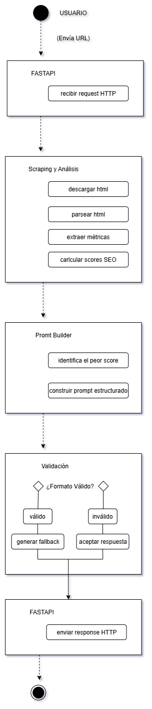

##################
El modelo LLM debe descargarse localmente y configurarse mediante la variable de entorno `LLM_MODEL_PATH`.
##################

# ANALISTA DE POSICIONAMIENTO SEO PARA PAGINAS EDITORIALES

El presente proyecto surge de la necesidad de generar una herramienta que articules web scrapping - integración IA y FastAppi.  
Determine que el mismo respondiese a un análisis de tipo editorial-estructural a partir de la información de posicionamiento SEO para los motores de búsquedas aportados por SCHEMA.ORG.

## OBJETIVOS PROPUESTOS

- Analizar páginas web estructurales desde una perspectiva SEO técnica.
- Calcular scores parciales y ponderados por elementos.
- Generar recomendaciones claras a partir del score más bajo para mejorar el posicionamiento SEO.
- Evitar dependencias externas, correr todo el proyecto en local.
- Generar una interfaz simple y entendible al usuario común.

## ARQUITECTURA DEL SISTEMA

Usuario (URL)
↓
FastAPI (manejo HTTP)
↓
Scraping y Análisis SEO (determinístico)
↓
Prompt Builder (determinístico)
↓
LLM local (Mistral 7B)
↓
Validación de salida
↓
Respuesta HTTP

Diagrama de flujo UML:

## FLUJO DE TRABAJO

El flujo de trabajo en un escenario ideal se desarolla de la siguiente manera:

1. Usuario ingresa URL
2. Se toma el html y se parsea con con BeautifulSoup
3. Extracción de los elementos necesarios para el análisi seo
4. A partir de la estructura se determina el tipo de página.
5. Entra en juego el árbol de decisiones:
   - 5.A Si el schema incluye `"Product"`:
     - Se ejecuta la función de análisis de producto.
   - 5.B Si existe la etiqueta `<article>`:
     - Se ejecuta la función de análisis editorial.
   - 5.C Si existe la etiqueta `<main>`:
     - Se ejecuta la función de análisis webpage.
   - 5.D Si solo existe la etiqueta `<body>`:
     - Se ejecuta la función de análisis webpage como fallback.
6. Se calculan los puntajes según:
   - Contenido de texto
   - Distribución de párrafos
   - Jerarquía de encabezados
   - Enlaces internos y externos
7. Se ajustan los pesos de los puntajes según el tipo de contenido detectado
8. Se normaliza el puntaje final.
9. Se devuelven los resultados obtenidos

Cómo se puede observar la lógica de análisis funciona mediante un árbol de toma de decisiones según el tipo de pagina web y/o contenedor dominante, la IA solo se limita a analizar el score final a fin de generar recomendaciones.  
**NO ES LA IA QUIEN PUNTEA, PONDERA Y DEFINE EL SCORING**, esto permite mayor libertad para calibrar, incorporar o editar el comportamiento lógico del proyecto.

## MODULOS PRINCIPALES

1. FastAPI  
2. Scraping y Análisis  
3. Prompt Builder  
4. LLM Local (Mistral 7B)  
5. Capa de validación  

## LLM LOCAL

Decidí usar Mistral como IA de recomendación para el mejorar el score de posicionamiento SEO por ser un modelo relativamente liviano de fácil integración con Python y por no existir dependencias con APIS externas.  
Limité el tamaño de ventana de contexto por tratarse de un prompt estructurado y corto.  
La cantidad de 4 hilos de CPU es por cuestiones meramente operativas.  
Tokens procesados en paralelo: 128. Mantiene equilibrio entre velocidad y memoria.  
El prompt fue calibrado mediante evaluación asistida por IA - ChatGPT.

## UI / FRONTEND

El HTML y CSS del proyecto fueron generados con asistencia de IA, integrados sobre plantillas Jinja2 y posteriormente ajustados manualmente.

## Capturas de pantalla

### Pantalla de inicio

### Resultados del análisis SEO

### Patalla de error

## TECNOLOGÍAS UTILIZADAS

- Python 3
- FastAPI
- BeautifulSoup
- llama.cpp
- Mistral 7B Instruct (cuantizado)
- UML 2.5 (Diagrama de actividades)
